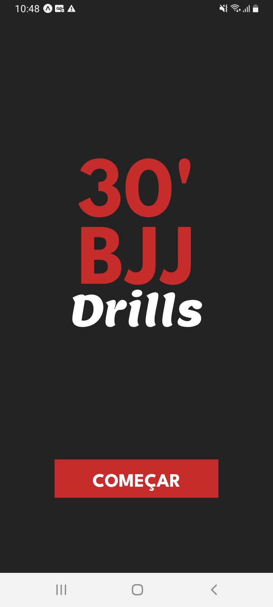
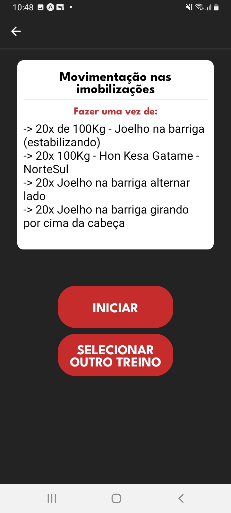
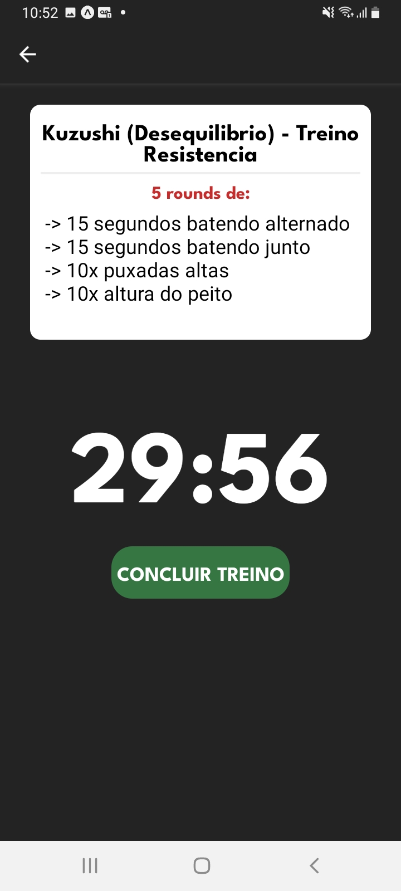
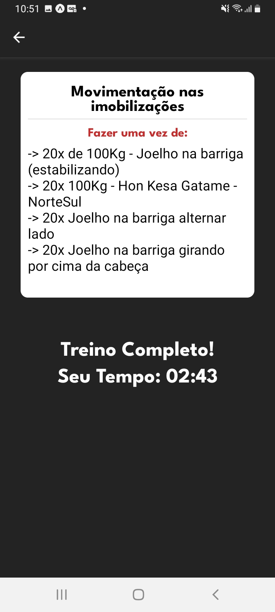
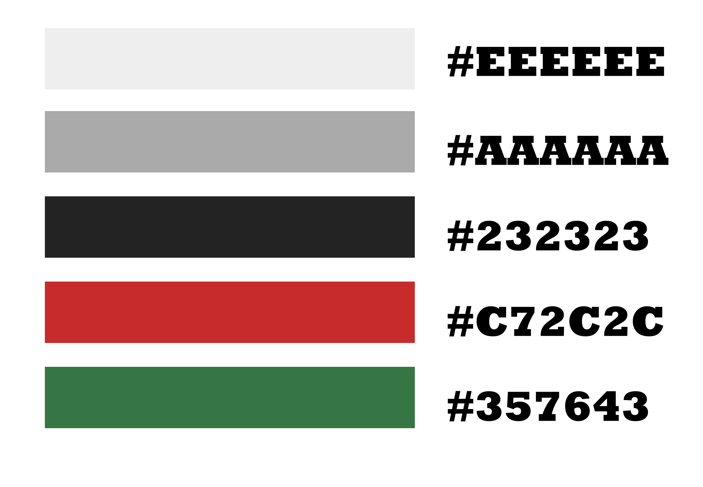
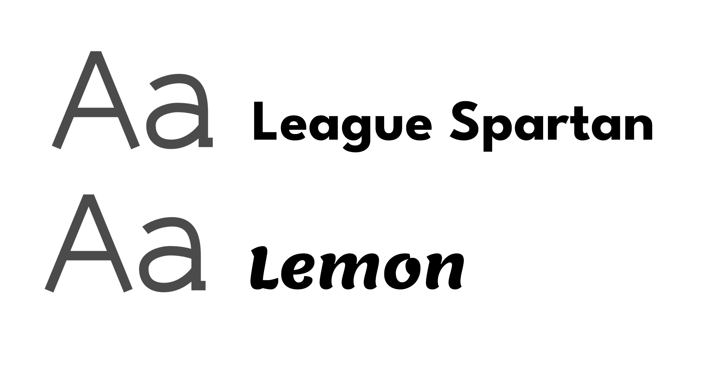

# 30' BJJ drills
 

# Sobre o projeto
30' BJJ drills é uma aplicação mobile que gera treinos de preparação fisica para o Jiu Jitsu, para serem executados em 30 minutos no máximo.

Os treinos foram elaborados pelo desenvolvedor do aplicativo que é praticante de Jiu Jitsu há mais de 10 anos, atualmente Faixa Preta.

# Layout do App
     

# Paleta de cores

# Fontes

# Tecnologias utilizadas
- React Native
- Expo

# Autor
Kelvin Vale dos Anjos
